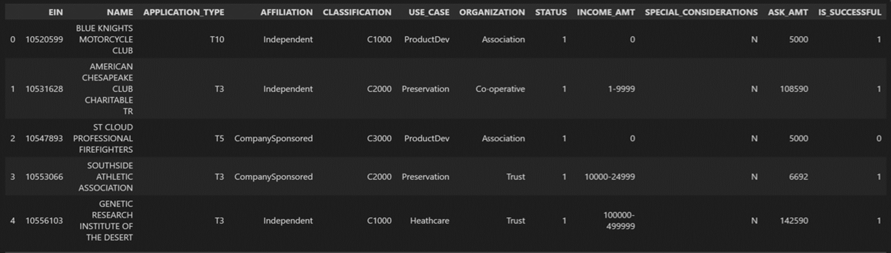

# Charity Funding Predictor

## Objective
Using machine learning and neural networks, to create a binary classifier that can predict whether applicants will be successful if funded by Alphabet Soup. 
The dataset contains more than 34,000 organizations that have received funding from Alphabet Soup over the years with columns as following:

## Instructions

### 1. Data Preprocessing
Using Pandas and the Scikit-Learn’s `StandardScaler()`, preprocess the dataset in order to compile, train, and evaluate the neural network model later.
1. Read in the [charity_data.csv](Resources/charity_data.csv) to a Pandas DataFrame.
2. Drop the `EIN` and `NAME` columns.
3. Determine the number of unique values for each column.
4. Pick a cutoff point to bin "rare" categorical variables as `Other`.
5. Use `pd.get_dummies()` to encode categorical variables

### 2. Compiling, Training, and Evaluating the Model
Using TensorFlow, design a neural network model to create a binary classification model that can predict if an Alphabet Soup–funded organization will be successful based on the features in the dataset. Consider how many inputs there are before determining the number of neurons and layers in your model. Once completed, compile, train, and evaluate the binary classification model to calculate the model’s loss and accuracy.

1. Continue using the [Jupyter Notebook](Starter_Code.ipynb) which already performed the preprocessing steps from Step 1.
2. Create a neural network model by assigning the number of input features and nodes for each layer using Tensorflow Keras.
3. Create the first hidden layer, a second hidden layer, and an output layer with an appropriate activation function, and check the structure of the model.
4. Compile and train the model. (Create a callback that saves the model's weights every 5 epochs)
5. Evaluate the model using the test data to determine the loss and accuracy.
6. Save and export your results to an HDF5 file as [AlphabetSoupCharity.h5](Resources/AlphabetSoupCharity.h5).

### 3. Model Optimization
Using TensorFlow, optimize the model by creating a new [Jupyter Notebook](AlphabetSoupCharity_Optimzation.ipynb). Preprocess the dataset the same as Step 1, and design a neural network model, taking into account any modifications that will optimize the model to achieve higher than 75% accuracy. (If unsuccessful, make at least three attempts) Save and export your results to an HDF5 file as [AlphabetSoupCharity_Optimization.h5](Resources/AlphabetSoupCharity_Optimization.h5).

### 4. Report on the Neural Network Model
Write a report on the performance of the deep learning model that was created for AlphabetSoup which includes the following: 
1. **Overview** of the analysis: Explain the purpose of this analysis.
2. **Results**: Using bulleted lists and images to support your answers, address the following questions.
  * Data Preprocessing
    * What variable(s) are considered the target(s) for your model?
    * What variable(s) are considered to be the features for your model?
    * What variable(s) are neither targets nor features, and should be removed from the input data?
  * Compiling, Training, and Evaluating the Model
    * How many neurons, layers, and activation functions did you select for your neural network model, and why?
    * Were you able to achieve the target model performance?
    * What steps did you take to try and increase model performance?
3. **Summary**: Summarize the overall results of the deep learning model. Include a recommendation for how a different model could solve this classification problem, and explain your recommendation.
