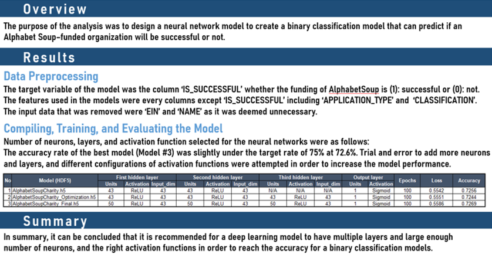

# Charity Funding Predictor

## Objective
Using machine learning and neural networks, to create a binary classifier that can predict whether applicants will be successful if funded by Alphabet Soup. 
The dataset contains more than 34,000 organizations that have received funding from Alphabet Soup over the years with columns as following:

## Instructions

### 1. Data Preprocessing
Using Pandas and the Scikit-Learn’s `StandardScaler()`, preprocess the dataset in order to compile, train, and evaluate the neural network model later.
* Read in the [charity_data.csv](Resources/charity_data.csv) to a Pandas DataFrame.
* Drop the `EIN` and `NAME` columns.
* Determine the number of unique values for each column.
* Pick a cutoff point to bin "rare" categorical variables as `Other`.
* Use `pd.get_dummies()` to encode categorical variables

### 2. Compiling, Training, and Evaluating the Model
Using TensorFlow, design a neural network model to create a binary classification model that can predict if an Alphabet Soup–funded organization will be successful based on the features in the dataset. Consider how many inputs there are before determining the number of neurons and layers in your model. Once completed, compile, train, and evaluate the binary classification model to calculate the model’s loss and accuracy.

Continue using the [Jupyter Notebook](Starter_Code.ipynb), and create a neural network model by assigning the number of input features and nodes for each layer using Tensorflow Keras (first hidden layer, a second hidden layer, and an output layer with an appropriate activation function), and check the structure of the model. Compile, train, and evaluate the model using the test data to determine the loss and accuracy. Save the results to an HDF5 file as [AlphabetSoupCharity.h5](Resources/AlphabetSoupCharity.h5).

### 3. Optimizing the Model
Using TensorFlow, optimize the model by creating the [New Jupyter Notebook](AlphabetSoupCharity_Optimzation.ipynb). Redo the data preprocessing, and redesign a neural network model taking into account any modifications that will optimize the model to achieve higher than 75% accuracy. (If unsuccessful, make at least three attempts) Save the results to an HDF5 file as [AlphabetSoupCharity_Optimization.h5](Resources/AlphabetSoupCharity_Optimization.h5).

### 4. Report on the Neural Network Model

